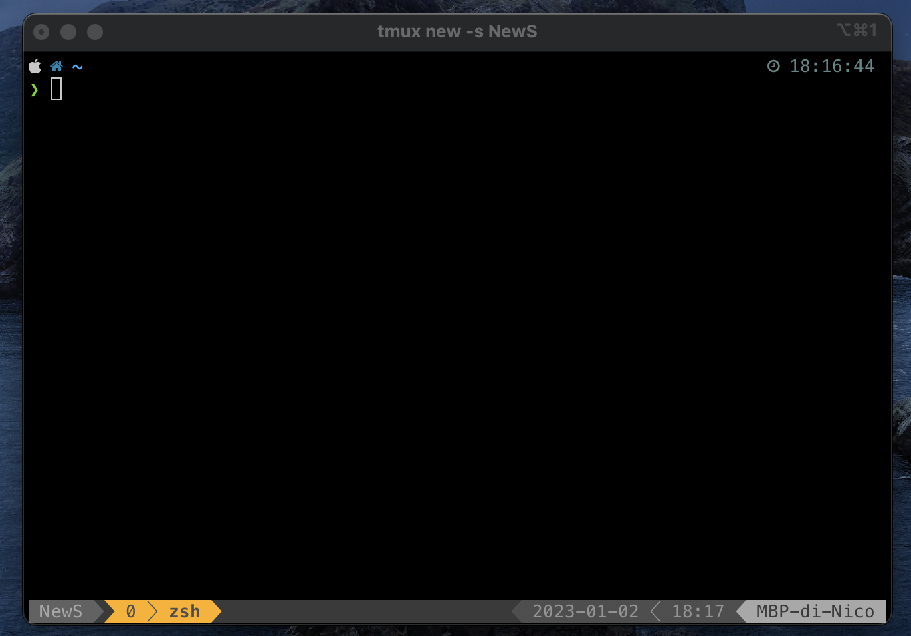

## .tmux.conf

Fare il clone del repository:
```
git clone https://github.com/tmux-plugins/tpm ~/.tmux/plugins/tpm
```

File di configurazione [`.tmux.conf`](./.tmux.conf) da capiare in `~/`. Successivamente eseguire il comando `ctrl-B + I` in modo da aggiornare

Un esempio di file di configurazione è il seguente

```
# Configure True Colors
set -g default-terminal "screen-256color"

# Change keybinds for splitting windows
unbind %
bind | split-window -h

unbind '"'
bind - split-window -v

# Add keybinds for easily resizing tmux panes
bind -r j resize-pane -D 5
bind -r k resize-pane -U 5
bind -r l resize-pane -R 5
bind -r h resize-pane -L 5

# Add keybind for maximizing and minimizing tmux pane
bind -r m resize-pane -Z

# Enable the mouse in tmux
# If active ctrl+c for copy doesn't run correctly
set -g mouse on

# tpm plugin
set -g @plugin 'tmux-plugins/tpm'

# list of tmux plugins
set -g @plugin 'egel/tmux-gruvbox'
set -g @tmux-gruvbox 'dark' # or 'light'
set -g @plugin 'tmux-plugins/tmux-resurrect' # persist tmux sessions after computer restart
set -g @plugin 'tmux-plugins/tmux-continuum' # automatically saves sessions for you every 15 minutes

set -g @resurrect-capture-pane-contents 'on' # allow tmux-ressurect to capture pane contents
set -g @continuum-restore 'on' # enable tmux-continuum functionality

# Set scrollback buffer to 10000
# set -g history-limit 10000

# Not rename panel
set-option -g allow-rename off

# Initialize TMUX plugin manager (keep this line at the very bottom of tmux.conf)
run '~/.tmux/plugins/tpm/tpm'
```


## Comandi Tmux

| Command | Description |
| --- | --- |
| `tmux` | start tmux |
| `tmux new -s name` | start tmux with name |
| `tmux ls` | shows the list of sessions |
| `tmux a #` | attach the detached-session |
| `tmux a -t name` | attach the detached-session to name |
| `tmux kill-session –t name` or `ctrl+b :kill-session` | kill the session name |
| `tmux kill-server` | kill the tmux server |

## Comandi Windows

Note

ctrl-d can be used to close the window or panes **without** using ctrl-a.

 
| Command | Description |
| --- | --- |
| w | list windows and select one |
| , | rename window |
| c or N | create new window |
| n | go to next window |
| p | go to previous window |
| f | find window |
| & | kill window |
| 0-9 | go to window 0-9 |
| x | close pane |
| shift + sx mouse| select |
| shift + ctrl + c | copy |
| \| | divide la pagina in verticale |
| - | divide la pagina in orizzontale |


## Riferimenti

* [1. TMUX commands — TMUX Guide documentation](https://tmuxguide.readthedocs.io/en/latest/tmux/tmux.html)
* [GitHub - rothgarawesome-tmux A list of awesome resources for tmux](https://github.com/rothgar/awesome-tmux#themes)
* [How To Use and Configure Tmux Alongside Neovim](https://www.josean.com/posts/tmux-setup)

